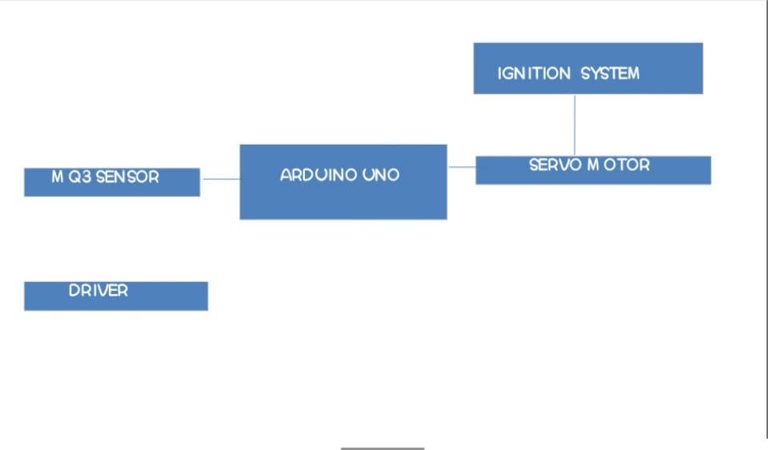

# Drunk and Drive prevention before happening
## Introduction
This project will prevent drunk and drive before happening.The MQ3 sensor will detect the alcoholic limit.if it is more than the normal limit.The arduino makes servo motor to disconnect from the ignition system
## Block diagram

## Sensors and actuator
- MQ3 SENSOR
- Ignition System
- Servo motor
- Arduino UNO
## High level implementation
|  ID  |  Description  |
| ------  | ------  |
|  HLR1  | detect alcohol percent in air | 
|  HLR2  |  turning ignition off  |
|  HLR3  |  Alert driver using buzzer|
## Low level implementation
|  ID  |  Description  |
| ------  | ------  |
|  LLR1  |  detect the alcohol % take reading from MQ3 sensor| 
|  LLR2  |  The servo motor holding conductor connecting ignition in place will disconnect   |
|  LLR3  |  buzzer starts alerting user based on reading |
## Applications

- can be used in cars 
- can be used at accident prone checkpoints
